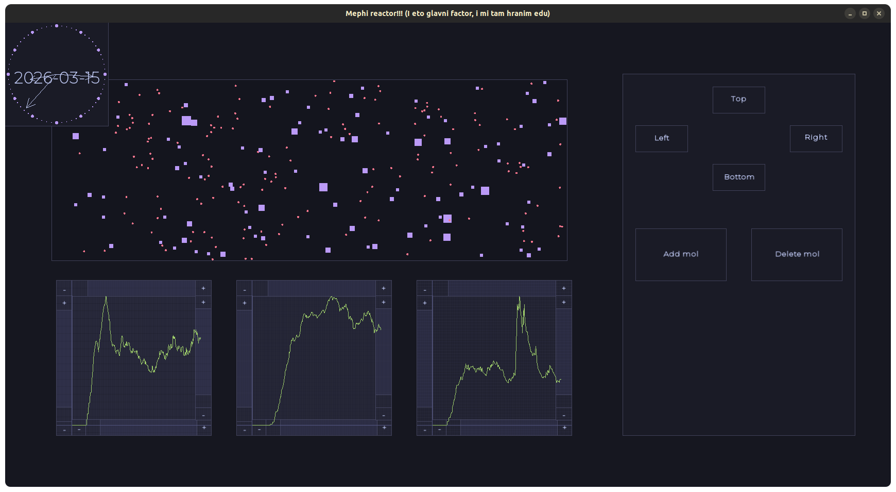

---
author:
- Попов Владимир Сергеевич, Б01-411, 2 курс ИВТ ФРКТ МФТИ
---

# Mephi Reactor

Учебный проект реализации реактора со взаимодействующими частицами. Целью было изучить концепции наследования и виртуализации, а также поработать с графической библиотеками.

Есть главный реактор, просто прямоугольник, у которого стенки имеют температуру. Есть панель управления им, а также графики, выводящие с него информацию. Внутри реактора летают частицы двух типов: кружочки и квадратики, которые могут реагировать друг с другом и обмениваться теплом со стенками. Вот как это выглядит



Первый график показывает количество кружков, второй - количество квадратиков, третий - суммарную температуру стенок.

Кнопками на панели управления, можно добавлять молекулы, удалять их, а также нагревать определённые стенки.

Часы для вайба, чтобы протестировать удобство и гибкость архитектуры создания окон.

## Зависимости

| Зависимость           | Минимальная версия    | Назначение                                    |
|-----------------------|-----------------------|-----------------------------------------------|
| **CMake**             | 3.21                  | Сборка проекта и зависимостей                 |
| **g++**               | 11.4                  | Компиляция C++20 кода                         |
| **сигареты**          | 3.0.1                 | Импотенция                                    |
| **SFML**              | 2.5.1                 | GUI                                           |
| **X11**               | 1.7.5                 | Без него может некорректно работать SFML      |


## Использование

```bash
$ git clone https://github.com/kzueirf12345/mephi_reactor.git
$ cd mephi_reactor
$ cmake -B build -DCMAKE_BUILD_TYPE=RelWithDebInfo 
$ cmake --build build -j$(nproc)
$ ./build/mephi_reactor
```

## Взаимодействия

У кружков масса всегда 1. У квадратов всегда больше 1.
Частицы вступают в реакцию по следующим правилам:

Частица |кружок | квадрат
---- | ---- | ----
кружок | появляется квадрат с массой 2 и скоростью равной среднему арифметическому | квадрат поглощает кружок и меняет скорость $u_{\square} = \frac{m_{\circ} \cdot u_{\circ} + m_{\square} \cdot u_{\square}}{m_{\circ} + m_{\square}}$
квадрат | квадрат поглощает кружок и меняет скорость $u_{\square} = \frac{m_{\circ} \cdot u_{\circ} + m_{\square} \cdot u_{\square}}{m_{\circ} + m_{\square}}$ | Происходит взрыв, создаётся $m_{\square1} + m_{\square2}$ кружков со скоростями равными сумме скорости центра масс и относительной скорости, полученной из равенства кинетических энергий, направленной равномерно по кругу для каждого кружка

Хочется иметь функцию Intersect(Molecule& mol1, Molecule& mol2) с виртуализацией сразу по 2 параметрам. Язык С++ из коробки не предоставляет такого функционала. Можно использовать двойную диспетчеризацию, и хоть это и изящное решение, но с большим оверхедом. В этом проекте для более глубокого понимания работы виртуальных таблиц я реализовал собственный механизм виртуальных функций с двумерной виртуальной таблицей.

При столкновении со стенкой считается разница температур и умножается на коэффициент аккомодации стенки. Если температура стенки больше температуры частицы, то стенка охлаждается, а скорость (значит и кинетическая энергия) частицы растёт, и наоборот также.

## Оконная библиотека

Используется древовидная структура окон. Все события распространяются от корня к листьям.

Есть базовый класс ```Window``` от которого наследуются более специфичные. Каждое окно должно поддерживать следующие состояния и реализовывать следующие методы пропагации событий детям.

```cpp
class Window {

protected:

    Mephi::Rect rect_;
    std::vector<std::unique_ptr<Mephi::Window>> children_;
    Mephi::Window* parent_;

    bool isDraggable_; ///< Сейчас перемещается
    bool isSelected_; ///< Забирает все события клавиатуры
    bool isHovered_; ///< Наведена мышка и нет детей, на которых она тоже наведена
    bool isIndirectHovered_; ///< Наведена мышка, но могут быть дети, на которых тоже наведена
    bool isFocused_; ///< Забирает все события мышки

public:

    virtual bool OnKeyboardPress  (Mephi::EventKeyboardButton event) = 0;
    virtual bool OnKeyboardUnpress(Mephi::EventKeyboardButton event) = 0;
    virtual bool OnMouseMove      (Mephi::EventCoord          event) = 0;
    virtual bool OnMousePress     (Mephi::EventMouseButton    event) = 0;
    virtual bool OnMouseUnpress   (Mephi::EventMouseButton    event) = 0;
    virtual bool OnMouseDrag      (Mephi::EventCoord          event) = 0;
    virtual bool OnIdle           ()                                 = 0;

}
```

Возвращаемое значение handle-ров говорит о том, было ли обработано событие, а родитель в зависимости от этого может принять решение распространять событие дальше или нет.

Окна можно перемещать зажав среднюю кнопку мыши.